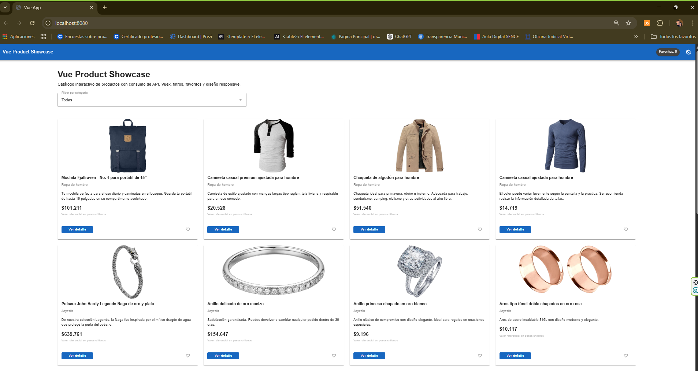
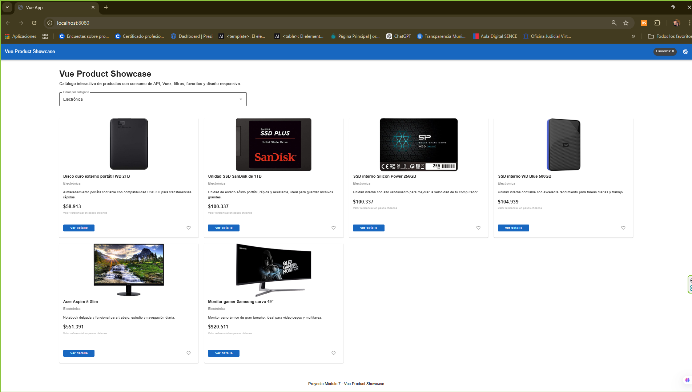
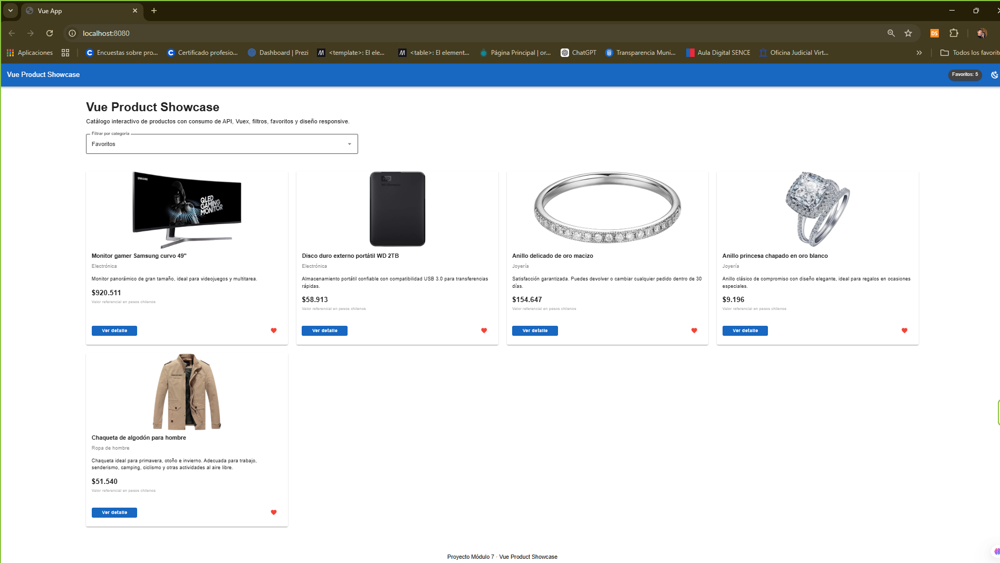
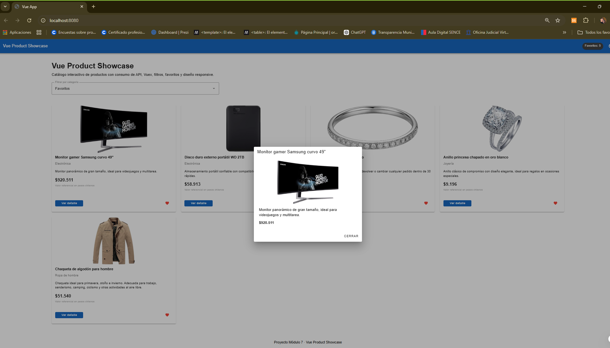

# 🛍️ Vue Product Showcase

Aplicación web desarrollada con Vue.js que permite visualizar un catálogo de productos, filtrarlos por categoría y gestionar favoritos. El proyecto consume datos desde una API externa y aplica buenas prácticas de desarrollo frontend moderno.

---

## 🚀 Tecnologías utilizadas

* Vue 3
* Vuex 4
* Axios
* Vuetify
* Jest + Vue Test Utils
* Cypress

---

## 📦 Funcionalidades principales

* 📡 Consumo de API (Fake Store API)
* 🛒 Visualización de productos en tarjetas
* 🔎 Filtro por categoría (incluye favoritos)
* ❤️ Gestión de favoritos con Vuex
* 🎯 Feedback visual en favoritos (icono dinámico ❤️)
* ⏳ Estados de carga (loading, error, vacío)
* 🌙 Modo claro / oscuro
* 💰 Conversión de precios de USD a CLP
* 🌐 Interfaz completamente en español
* 🔍 Modal de detalle de producto

---

## 🧠 Arquitectura del proyecto

El proyecto está organizado en módulos para mantener una estructura limpia y escalable:

```
vue-product-showcase/
│
├── docs/
│   └── images/
│       ├── inicio.png
│       ├── filtro.png
│       ├── favoritos.png
│       └── modal.png
│
src/
│
├── assets/
├── components/
│   ├── AppHeader.vue
│   ├── AppFooter.vue
│   ├── ProductCard.vue
│   ├── ProductList.vue
│   ├── CategoryFilter.vue
│   ├── LoadingState.vue
│   ├── ErrorState.vue
│   └── EmptyState.vue
│
├── data/
│   └── translations.js
│
├── plugins/
│   └── vuetify.js
│
├── services/
│   └── api.js
│
├── store/
│   ├── index.js
│   └── modules/
│       ├── products.js
│       ├── filters.js
│       ├── favorites.js
│       └── theme.js
│
├── App.vue
└── main.js
```

---

## 🔄 Consumo de API

Se utiliza la API pública:

https://fakestoreapi.com/products

Los datos son obtenidos mediante Axios y almacenados en Vuex para su reutilización en toda la aplicación.

---

## 🔍 Filtro de productos

El sistema permite:

* Filtrar por categoría
* Mostrar todos los productos
* Filtrar solo productos favoritos ❤️

Esto se implementa mediante Vuex y lógica reactiva en los componentes.

---

## ❤️ Gestión de favoritos

Los productos pueden ser marcados como favoritos mediante un botón interactivo.

* Se almacenan en Vuex
* Se pueden visualizar mediante el filtro "Favoritos"
* Incluyen feedback visual dinámico (icono rojo ❤️)

---

## 🔍 Modal de detalle

Cada producto incluye un botón **"Ver detalle"** que despliega un modal con:

* Imagen ampliada
* Descripción completa
* Precio

Esto mejora la experiencia del usuario.

---

## 💰 Conversión de moneda

Los precios obtenidos en USD son convertidos a pesos chilenos (CLP) utilizando un valor referencial.

```javascript
new Intl.NumberFormat('es-CL', {
  style: 'currency',
  currency: 'CLP',
  maximumFractionDigits: 0
})
```

> ⚠️ Nota: Los valores son referenciales y pueden variar según el tipo de cambio.

---

## 🌐 Internacionalización básica

Se realizó una adaptación al español mediante:

* Traducción de categorías
* Traducción de títulos y descripciones
* Conversión de moneda a CLP

---

## 🧪 Pruebas

### Pruebas unitarias

Se implementaron con:

* Jest
* Vue Test Utils

Ejemplos:

* Renderizado de ProductCard
* Manejo de props

### Pruebas e2e

Se utilizó Cypress para validar la interacción básica del usuario.

---

## 📱 Diseño y UX

Se utilizó Vuetify para:

* Diseño responsive
* Sistema de grillas
* Componentes modernos
* Modo claro/oscuro

---

## ▶️ Instalación y ejecución

1. Clonar el repositorio:

```bash
git clone <url-del-repositorio>
cd vue-product-showcase
```

2. Instalar dependencias:

```bash
npm install
```

3. Ejecutar el proyecto:

```bash
npm run serve
```

4. Abrir en navegador:

```
http://localhost:8080
```

---

## 🧪 Ejecutar pruebas

### Unitarias

```bash
npm run test:unit
```

### End to End

```bash
npm run test:e2e
```

---

## 📸 Evidencias

Se incluyen capturas de:

* Vista principal


* Filtro por categoría


* Productos favoritos


* Modal de detalle


---


## 👨‍💻 Autor
Proyecto desarrollado por:

Cristián Hernández Muñoz

Curso: Desarrollo de aplicaciones front-end con Vue.js
Modulo 7